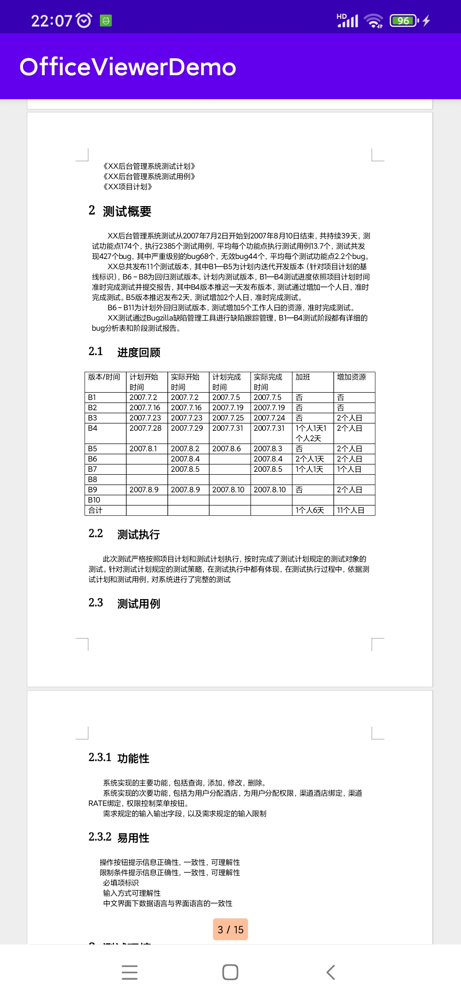
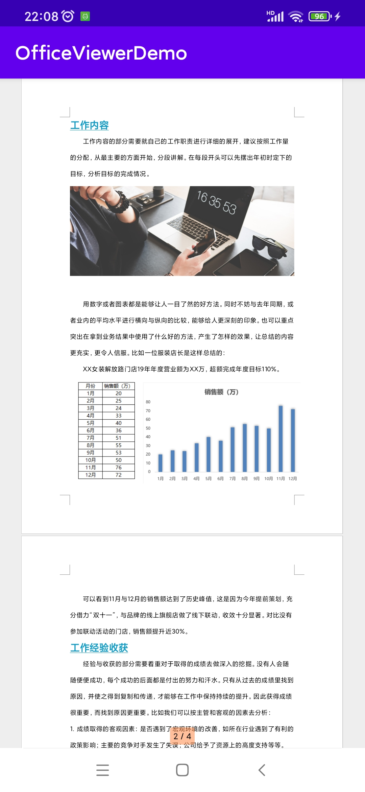
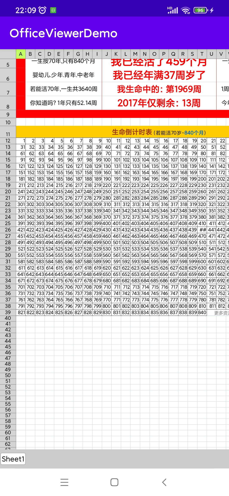

# OfficeViewer

### 功能介绍
OfficeViewer是Android平台用于实现文档预览的一套UI组件，主要用于在应用内显示简单的文档文件，不支持文档编辑功能。

### 支持格式
主要支持的文件格式如下：
- [x] doc
- [x] docx
- [x] xls
- [x] xlsx
- [x] ppt
- [x] pptx

除了以上6种文件格式之外，其他格式均不支持。


### 使用方法
OfficeViewer组件集成和使用都比较简单，具体步骤如下：       
**注意**：以下集成步骤基于AndroidStudio开发工具。

1. 导入`OfficeViewer.aar`文件至libs目录下

2. 修改app目录下的build.gradle文件

```groovy
dependencies {

    // add
    implementation files("libs/OfficeViewer-1.0.aar")

}
```

3. 在显示文档文件的Activity中引入OfficeViewer组件

OfficeViewer组件需要一个FrameLayout父容器承载，Activity布局文件中需要创建一个FrameLayout布局

```xml
<?xml version="1.0" encoding="utf-8"?>
<FrameLayout xmlns:android="http://schemas.android.com/apk/res/android"
    android:id="@+id/fl_office_viewer"
    android:layout_width="match_parent"
    android:layout_height="match_parent"
    android:background="@color/white">

</FrameLayout>
```

OfficeViewer仅支持通过文件的绝对路径加载文件，**示例**：`/storage/emulated/0/Documents/doc_test.doc`        
其他的路径格式均不支持，加载文件需要从外部传入文件的绝对路径

```java
public class FileShowActivity extends Activity {

    private OfficeViewer officeViewer;

    @Override
    protected void onCreate(Bundle savedInstanceState) {
        super.onCreate(savedInstanceState);
        setContentView(R.layout.activity_file_show);

        FrameLayout frameLayout = findViewById(R.id.fl_office_viewer);
        String filePath = getIntent().getStringExtra("filePath");

        officeViewer = new OfficeViewer(this);
        officeViewer.loadFile(frameLayout, filePath);
    }

    @Override
    protected void onDestroy() {
        officeViewer.dispose();
        officeViewer = null;
        super.onDestroy();
    }
}
```

具体使用方法请参考Demo程序

### 效果截图
文件显示效果图如下：

**doc文件**

**docx文件**


**xls文件**

**xlsx文件**


**ppt文件**

**ppt文件横屏显示**

**pptx文件**

**pptx文件横屏显示**


### 实现原理
OfficeViewer组件使用Apache POI开源库二次开发实现

>  Apache POI是Apache的开源库，是用Java语言编写的一套API给Java程序对Microsoft Office格式文件读和写的功能。

OfficeViewer组件中的doc, docx, xls, xlsx, ppt, pptx这几种格式的文件都是通过Apache POI解析实现。


### 相关链接      
Apache POI：<https://poi.apache.org/>      
poi src: <https://github.com/apache/poi>      